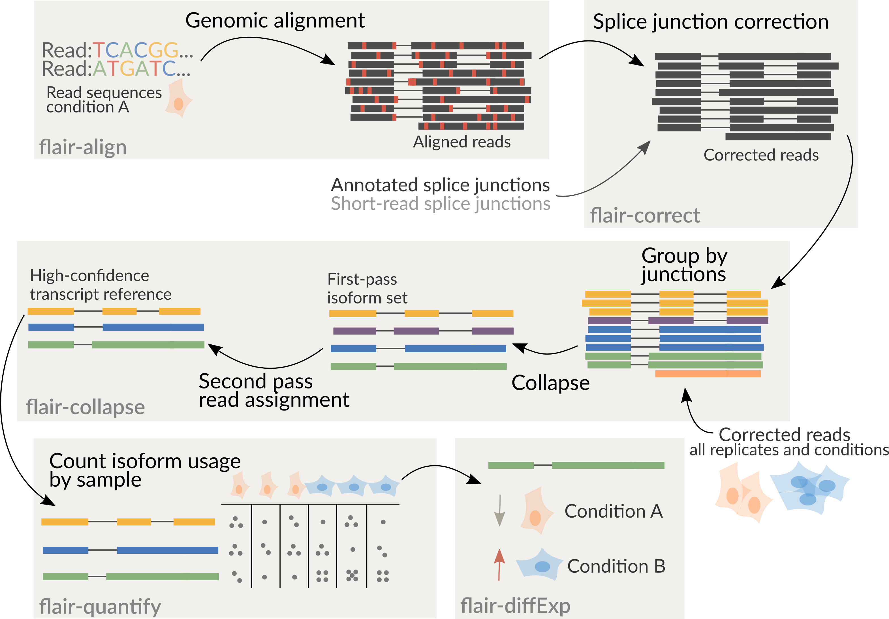

# flair
FLAIR (Full-Length Alternative Isoform analysis of RNA) for the correction, isoform definition, and alternative splicing analysis of noisy reads. FLAIR has primarily been used for nanopore cDNA, native RNA, and PacBio sequencing reads. 

## Table of Contents

- [Overview](#overview)
- [Requirements](#requirements)
- [FLAIR modules](#modules)
	- [align](#align)
	- [correct](#correct)
		- [short-read junctions](#short)
	- [collapse](#collapse)
	- [quantify](#quantify)
		- [appending counts to a psl](#append)
	- [diffExp](#diffExp)
- [Scripts](#scripts)
- [Docker](#docker)
- [Example Files](#exfiles)


## <a name="overview"></a>Overview
FLAIR can be run optionally with short-read data to help increase splice site accuracy of the long read splice junctions. FLAIR uses multiple alignment steps and splice site filters to increase confidence in the set of isoforms defined from noisy data. FLAIR was designed to be able to sense subtle splicing changes in nanopore data from [Tang et al. (2018)](https://www.biorxiv.org/content/early/2018/09/06/410183). Please read for more description of some methods.



It is recommended to combine all samples together prior to running flair-collapse for isoform assembly by concatenating corrected read `psl` files together. Following the creation of an isoform reference from flair-collapse, consequent steps will assign reads from each sample individually to isoforms of the combined assembly for downstream analyses.

It is also good to note that `bed12` and `PSL` can be converted using [kentUtils](https://github.com/ENCODE-DCC/kentUtils/tree/master/src/hg/utils) bedToPsl or pslToBed, or using `bin/bed_to_psl.py`.

## <a name="requirements"></a>Requirements

1. python v2.7+ and python modules: Cython, intervaltree, kerneltree, tqdm, pysam v0.8.4+, pybedtools
2. bedtools, samtools
3. [minimap2](https://github.com/lh3/minimap2)

## <a name="modules"></a>FLAIR modules 
`flair.py` is a wrapper script with modules for running various processing scripts located in `bin/`. Modules are assumed to be run in order (align, correct, collapse), but the user can forgo the wrapper if a more custom build is desired. 

### <a name="align"></a>flair align
Aligns reads to the genome using minimap2, and converts the aligned minimap2 `sam` output to [BED12](https://genome.ucsc.edu/FAQ/FAQformat.html#format14) and optionally [PSL](https://genome.ucsc.edu/FAQ/FAQformat.html#format2). Aligned reads in `psl` format can be visualized in IGV or the UCSC Genome browser. As for which human reference genome to use, Heng Li has written a [blog post](https://lh3.github.io/2017/11/13/which-human-reference-genome-to-use) on this.

Alternatively, the user can align the reads themselves with their aligner of choice and convert sorted `bam` output to `bed12` using `bin/bam2Bed12.py` to supply for flair-correct. This step smooths gaps in the alignment.

**Usage:**
```sh
python flair.py align -g genome.fa -r <reads.fq>|<reads.fa> [options]
```
run with `--help` for a description of optional arguments. Outputs (1) `sam` of raw aligned reads and (2) smoothed `bed12` file of aligned reads to be supplied to flair-correct.

### <a name="correct"></a>flair correct
Corrects misaligned splice sites using genome annotations and/or short-read splice junctions. Inputs are (1) tab-separated chromosome sizes file, (2) genome sequence, (3) aligned reads bed file, (4/5) genome annotation and/or short read splice junctions. Please note that the genome annotation and genome sequences must be compatible, and `gtf` is preferred over `gff` for annotation.

**Usage:**
```sh
python flair.py correct -c chromsizes -g genome.fa -q query.bed12 [-f annotation.gtf]V[-j introns.tab] [options]
```
run with `--help` for description of optional arguments.
Outputs (1) `*_all_corrected.bed` of corrected reads, (2) `*_all_inconsistent.bed` of reads that weren't able to be corrected, (3) `psl` of corrected reads to be supplied in flair-collapse.

#### <a name="short"></a>Short-read junctions
To use short-read splice sites to aid with correction, one option is `bin/junctions_from_sam.py` to extract splice junctions from short-read alignments. The `-s` option accepts either `sam` or `bam` files, and if there are multiple sams/bams they can be provided in a comma-separated list.

**Usage:**
```sh
python junctions_from_sam.py -s <shortreads.sam>|<shortreads.bam> -n outname
```
the file that can be supplied to flair-correct with `-j` is in the output file `outname_junctions.bed`. It is recommended that the user remove infrequently used junctions i.e. junctions with few supporting junction reads, which are in the 5th column of the junction bed file.

Alternatively, the `-j` argument for flair-correct can also be generated using STAR. STAR 2-pass alignment of short reads produces a compatible splice junction file (`SJ.out.tab`). We recommend filtering out junctions with few uniquely mapping reads (column 7).


### <a name="collapse"></a>flair collapse
Defines high-confidence isoforms from corrected reads. As FLAIR does not use annotations to collapse isoforms, FLAIR will pick the name of a read that shares the same splice junction chain as the isoform to be the isoform name. It is recommended to still provide an annotation with `-f`, which is used to rename FLAIR isoforms that match isoforms in existing annotation according to their 'transcript_id's. Again, isoforms in `psl` format can be visualized in IGV or the UCSC genome browser if any extra columns after column 21 are removed. 

If there are multiple samples to be compared, the flair-corrected read `psl` files should be concatenated prior to running flair-collapse. In addition, all raw reads should be concatenated into a single file or given as a comma-separated list for `-r`.

**Usage:**
```sh
python flair.py collapse -g genome.fa -r <reads.fq>|<reads.fa> -q query.psl [options]
```
run with `--help` for description of optional arguments.
Outputs the high-confidence isoforms in several formats: (1) `*isoforms.psl`, (2) `*isoforms.gtf`, as well as (3) an `*isoforms.fa` file of isoform sequences. Intermediate files are removed, but can be output for debugging purposes by supplying the argument `--keep_intermediate`.

### <a name="quantify"></a>flair quantify
Convenience function to quantifying FLAIR isoform usage across samples using minimap2. If isoform quantification in TPM is desired, please use the `--tpm` option. If the user prefer [salmon](https://combine-lab.github.io/salmon/getting_started/) to quantify transcripts using their nanopore reads, please specify a path to salmon using `--salmon`. For all options run flair-quantify with `--help`.

**Usage:**
```sh
python flair.py quantify -r reads_manifest.tsv -i isoforms.fasta [options]
```

**Inputs:**</br>
(1) `reads_manifest.tsv` is a tab-delimited file containing sample_name, condition, batch\*, and path to reads.fq/fa.
For exmaple:
```tsv
sample1	conditionA	batch1	./sample1_reads.fq
sample2	conditionA	batch1	./sample2_reads.fq
sample3	conditionA	batch2	./sample3_reads.fq
sample4	conditionB	batch1	./sample4_reads.fq
sample5	conditionB	batch1	./sample5_reads.fq
sample6	conditionB	batch2	./sample6_reads.fq
```
\* The batch descriptor is used in the downstream flair-diffExp analysis to model unintended variability due to secondary factors such as batch or sequencing replicate. If unsure about this option, leave this column defined as `batch1` for all samples.

(2) `isoforms.fasta` contains FLAIR collapsed isoforms produced by the [`flair collapse`](#collapse) module.

**Outputs:**</br>
(1) `count_matrix.tsv` which is a tab-delimited file containing isoform counts for each sample. For example:

```tsv
ids	samp1_conditionA_batch1	samp2_conditionA_batch1 samp3_conditionA_batch2	...
0042c9e7-b993_ENSG00000131368.3	237.0	156.0	165.0	150.0	...
0042d216-6b08_ENSG00000101940.13	32.0	14.0 	25.0	...
```

#### <a name="append"></a>Appending counts to a psl
To use the standalone [scripts](#scripts) such as `diff_iso_usage.py`, the counts matrix can be appended to the isoforms from flair-collapse after quantification. Please note that these scripts are made for pairwise comparisons, and the counts are appended in the order they appear in `count_matrix.tsv`. For differential isoform expression analysis between multiple samples with 3 or more replicates, proceed directly to flair-diffExp after flair-quantify.

**Usage:**
```sh
python append_counts_to_psl.py isoforms.psl counts_matrix.tsv output.psl
```

**Inputs:**</br>
(1) `isoforms.psl` from flair-collapse, `count_matrix.tsv` from flair-quantify, and `output.psl` output filename.

### <a name="diffExp"></a>flair diffExp
Performs differential isoform expression, differential gene expression, and differential isoform usage analyses. This module required additional python modules and R packages which are described below: 

#### Additional Requirements
1. python v2.7+ and python modules: pandas, numpy, rpy2
2. [DESeq2](https://bioconductor.org/packages/release/bioc/html/DESeq2.html)
3. [ggplot2](https://ggplot2.tidyverse.org)
4. [qqman](https://cran.r-project.org/web/packages/qqman/index.html)
5. [DRIMseq](http://bioconductor.org/packages/release/bioc/html/DRIMSeq.html)
6. [stageR](http://bioconductor.org/packages/release/bioc/html/stageR.html)

**Usage:**
```sh
python flair.py diffExp -q count_matrix.tsv -o output_directory [options]
```

**Inputs:**</br>
(1) `count_matrix.tsv` is a tab-delimited file generated by the [`flair quantify`](#quantify) module.

**Outputs:**</br>
(1) Files contained in the `output_directory` are tables and plots generated from the various R-packages used in this analysis, including raw deseq2/drimseq output tables with foldChange, isoform frequency and adjusted pvalues. 

## <a name="scripts"></a>Scripts

We have also provided standalone scripts for splicing and productivity analysis of quantified isoforms from flair-collapse output.

### mark_intron_retention.py

Requires three positional arguments to identify intron retentions in isoforms: (1) a `psl` of isoforms, (2) `psl` output filename, (3) `txt` output filename for coordinates of introns found.

**Usage:**
```sh
python mark_intron_retention.py isoforms.psl isoforms.ir.psl coords.txt
```
Outputs (1) an extended `psl` with an additional column containing either values 0 or 1 classifying the isoform as either spliced or intron-retaining, respectively; (2) `txt` file of intron retentions with format `isoform name` `chrom` `intron 5'` `intron 3'`. 

### mark_productivity.py

Requires three positional arguments to classify isoforms according to productivity: (1) reads or `psl` format, (2) `gtf` genome annotation, (3) `fasta` genome sequences.

**Usage:**
```sh
python mark_productivity.py psl annotation.gtf genome.fa > productivity.psl
```
Outputs an extended `psl` with an additional column containing either values 0, 1, or 2 corresponding to a productive, unproductive (premature stop codon), and lncRNA (no start codon) categories respectively. 

### find_alt3prime_5prime_ss.py

Requires two positional arguments to identify and calculate significance of alternative 5' and 3' splicing between two samples using Fisher's exact tests, and two arguments specifying output files: (1) an extended `psl` of isoforms containing two extra columns for read counts of each isoform per sample type, (2) the 0-indexed column number of the counts column for one sample, (3) the 0-indexed column number of the counts column for the other sample, (4) `txt` output filename for alternative 3' SS events, (5) `txt` output filename for alternative 5' SS events. See [appending counts to a psl](#append) for obtaining (1). 

**Usage:**
```sh
python find_alt3prime_5prime_ss.py isoforms.psl colnum1 colnum2 alt_acceptor.txt alt_donor.txt 
```
Output file format:
`chrom` `intron 5' coordinate` `intron 3' coordinate` `p-value` `strand` `sample1 intron count` `sample2 intron count` `sample1 alternative introns counts` `sample2 alternative introns counts` `isoform name` `canonical SS distance from predominant alternative SS` `canonical SS`

### diff_iso_usage.py
Requires four positional arguments to identify and calculate significance of alternative isoform usage between two samples using Fisher's exact tests: (1) an extended `psl` of isoforms containing two extra columns for read counts of each isoform per sample type, (2) the 0-indexed column number of expression values for the first condition, (3) the 0-indexed column number of expression values for the second condition, (4) `txt` output filename that assigns a p-value for each isoform. The more differentially used the isoforms are between the first and second condition, the lower the p-value. See [appending counts to a psl](#append) for obtaining (1).

**Usage:**
```sh
python diff_iso_usage.py isoforms.psl colnum1 colnum2 diff_isos.txt
```
Output file format: 
`gene name` `isoform name` `p-value` `sample1 isoform count` `sample2 isoform count` `sample1 alternative isoforms for gene count` `sample2 alternative isoforms for gene count` 

### NanoSim_Wrapper.py

A wrapper [script](https://github.com/BrooksLabUCSC/labtools/blob/master/NanoSim_Wrapper.py) written for simulating nanopore transcriptome data using [Nanosim](https://github.com/bcgsc/NanoSim). 


## Docker <a name="docker"></a>
If the user wishes to run FLAIR using [docker](https://docs.docker.com/) instead of cloning this repository, the following commands can be used:
`docker pull quay.io/brookslab/flair`
`docker run -w /usr/data -v [your_path_to_data]:/usr/data  -t -d [image_id]`
`docker exec [container_id] python3 /usr/local/flair/flair.py [your_command]`


## Example Files <a name="exfiles"></a>
We have provided the following [example files](https://users.soe.ucsc.edu/~brooks/FLAIR_example_files/):  
- `na12878.cdna.200k.fa`, containing 200,000 nanopore cDNA sequencing reads subsampled from the [Native RNA Consortium](https://github.com/nanopore-wgs-consortium/NA12878/blob/master/RNA.md). Running these reads through the align, correct, and collapse modules should take no more than 10 minutes with 4 threads and can be a way to quickly check that steps of FLAIR are working
- `cll_shortread_junctions.gp`, a [genepred-formatted](https://genome.ucsc.edu/FAQ/FAQformat.html#format9) file of splice junctions observed from short read sequencing of CLL samples that can be used in the correction step. Junctions from short read sequencing are optional (deprecated)
- `gencode_v24_complete.gp`, splice junctions from GENCODE v24 annotation that is supplied to the correction step (deprecated)

Other downloads:
- [promoter BED file](http://hgdownload.cse.ucsc.edu/goldenPath/hg18/encodeDCC/wgEncodeBroadHmm/wgEncodeBroadHmmGm12878HMM.bed.gz) to supplement in FLAIR-collapse for better TSS-calling for GM12878 cells
- [Native RNA Pass reads](https://github.com/nanopore-wgs-consortium/NA12878/blob/master/RNA.md) Running these 10 million nanopore reads from `fastq` through flair align, correct, and collapse modules to assembled isoforms with 8 threads requires ~3.5 hours (includes ~2.5 hours of minimap2 alignment)


