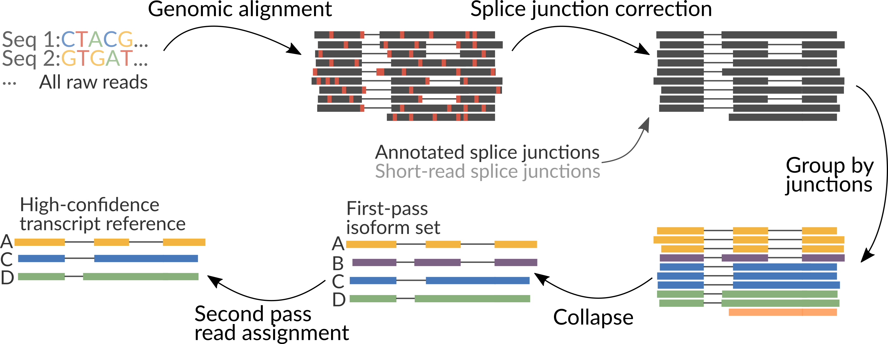

# flair
FLAIR (Full-Length Alternative Isoform analysis of RNA) for the correction, isoform definition, and alternative splicing analysis of noisy reads. FLAIR has primarily been used for nanopore cDNA, native RNA, and PacBio sequencing reads. 

## Table of Contents

- [Overview](#overview)
- [Requirements](#requirements)
- [FlAIR modules](#modules)
	- [align](#align)
	- [correct](#correct)
		- [short-read junctions](#short)
	- [collapse](#collapse)
		- [Quantification](#quant)
	- [quantify](#quantify)
	- [diffExp](#diffExp)

- [Scripts](#scripts)

## <a name="overview"></a>Overview
FLAIR can be run optionally with short-read data to help increase splice site accuracy of the long read splice junctions. FLAIR uses multiple alignment steps and splice site filters to increase confidence in the set of isoforms defined from noisy data. FLAIR was designed to be able to sense subtle splicing changes in nanopore data from [Tang et al. (2018)](https://www.biorxiv.org/content/early/2018/09/06/410183). Please read for more description of some methods.


It is recommended to combine all samples together prior to running FLAIR modules for isoform assembly, followed by read assignment of each sample individually to isoforms of the combined assembly for downstream analyses. It is also good to note that bed12 and PSL can be converted easily using [kentUtils](https://github.com/ENCODE-DCC/kentUtils/tree/master/src/hg/utils) bedToPsl or pslToBed, or using `bin/bed_to_psl.py`.

## <a name="requirements"></a>Requirements

1. python v2.7+ and python modules: Cython, intervaltree, kerneltree, tqdm, pysam v0.8.4+
2. bedtools, samtools
3. [minimap2](https://github.com/lh3/minimap2)

## <a name="modules"></a>FLAIR modules 
flair.py is a wrapper script with modules for running various processing scripts located in `bin/`. Modules are assumed to be run in order (align, correct, collapse), but the user can forgo the wrapper if a more custom build is desired. 

### <a name="align"></a>flair align
Aligns reads to the genome using minimap2, and converts the aligned minimap2 `sam` output to [BED12](https://genome.ucsc.edu/FAQ/FAQformat.html#format14) and optionally [PSL](https://genome.ucsc.edu/FAQ/FAQformat.html#format2). Aligned reads in `psl` format can be visualized in IGV or the UCSC Genome browser.

Alternatively, the user can align the reads themselves with their aligner of choice and convert `bam` output to `bed12` using `bin/bam2Bed12.py` to supply for flair-correct. This step smooths gaps in the alignment.

**Usage:**
```sh
python flair.py align -r <reads.fq>/<reads.fa> -g genome.fa [options]
```
run with `--help` for a description of optional arguments. Outputs (1) `sam` of raw aligned reads and (2) smoothed `bed12` file of aligned reads to be supplied to flair-correct.

### <a name="correct"></a>flair correct
Corrects misaligned splice sites using genome annotations. Please note that the genome annotation and genome sequences must be compatible.

**Usage:**
```sh
python flair.py correct -f annotation.gtf -c chromsizes.tsv -q query.bed12 [options]
```
run with `--help` for description of optional arguments.
Outputs (1) `bed12` of corrected reads, (2) `bed12` of reads that weren't able to be corrected, (3) `psl` of corrected reads to be supplied in flair-collapse.

#### <a name="short"></a>Short-read junctions
To use short-read splice sites to aid with correction, use [junctionsFromSam.py](https://github.com/BrooksLabUCSC/labtools/blob/master/junctionsFromSam.py) to extract splice junctions. 

**Usage:**
```sh
python junctionsFromSam.py -s shortreads.sam -n outname -o outdir
```
the file that can be supplied to flair-correct with `-j` is in the output file `outname_junctions.bed`.

Alternatively, splice junctions from STAR 2-pass alignment of short-reads (`SJ.out.tab`) can also be supplied for junctions.

### <a name="collapse"></a>flair collapse
Defines isoforms from corrected reads. By default, redundant isoforms (those that are proper subsets of another isoform in the set) are filtered out, an option that can be toggled with `-e`. As FLAIR does not use annotations to define isoforms, within a set of reads that define an isoform, FLAIR will pick the name of a read to be the isoform name. It is recommended to provide a GTF with `-f`, which is used to rename FLAIR isoforms that match isoforms in existing annotation according to their Ensembl ID. This can help with sorting for/against annotated isoforms just by `grep [-v] ENST`. Again, isoforms in `psl` format can be visualized in IGV or the UCSC genome browser if columns after 21 (1-indexed) are removed. 

Usage:
```sh
python flair.py collapse -r <reads.fq>/<reads.fa> -q query.psl -g genome.fa [options]
```
run with `--help` for description of optional arguments.
Outputs (1) extended `psl` containing the data-specific isoforms and (2) `fasta` file of isoform sequences.

#### <a name="quant"></a>Quantification
To quantify the expression of each isoform for a specific sample for use in other scripts:
1. Align read sequences to the isoform sequences using minimap2 (`--secondary=no` option recommended, alternatively primary alignments can be selectively retained with `samtools view -F 256 -S` on the resulting `sam`)
2. Count read-isoform assignments - `bin/count_sam_genes.py sam counts.txt`
3. Append a new column to the isoform file containing the sample-specific isoform expression - `bin/match_counts.py counts.txt isoforms.psl 1 isoforms.out.psl`

### <a name="quantify"></a>flair quantify
Convenience function to quantifying FLAIR isoform usage across samples using minimap2. 

**Usage**:
```sh
python flair.py quantify -r reads_manifest.tsv -i isoforms.fasta [options]
```

**Inputs**: <br>
(1) `reads_manifest.tsv` is a tab-delimited file containing sample_name, condition, batch\*, and path to reads.fq/fq.
For exmaple:
```tsv
sample1	conditionA	batch1	./sample1_reads.fq
sample2	conditionA	batch1	./sample2_reads.fq
sample3	conditionA	batch2	./sample3_reads.fq
sample4	conditionB	batch1	./sample4_reads.fq
sample5	conditionB	batch1	./sample5_reads.fq
sample6	conditionB	batch2	./sample6_reads.fq
```
\* The batch descriptor is used in the downstream diffExp analysis to model unintended variability due to secondary factors such as batch or sequencing replicate. If unsure about this option, leave this column defines as `batch1` for all samples.

(2) `isoforms.fasta` contains FLAIR collapsed isoforms produced by the [`flair collapse`](#collapse) module.

**Outputs**<br>
(1) `count_matrix.tsv` which is a tab-delimited file containing isoform counts for each sample. For example:

```tsv
ids	samp1_conditionA_batch1	samp2_conditionA_batch1 samp3_conditionA_batch2	...
0042c9e7-b993_ENSG00000131368.3	237.0	156.0	165.0	150.0	...
0042d216-6b08_ENSG00000101940.13	32.0	14.0 	25.0	...
```

### <a name="diffExp"></a>flair diffExp
Preforms differential isoform expression, differential gene expression and, differential isoform usage analyses. This module required additional python modules and R packages which are described below: 

#### Additional Requirements
1. python v2.7+ and python modules: pandas, numpy, rpy2
2. [DESeq2](https://bioconductor.org/packages/release/bioc/html/DESeq2.html)
3. [ggplot2](https://ggplot2.tidyverse.org)
4. [qqman](https://cran.r-project.org/web/packages/qqman/index.html)
5. [DRIMseq](http://bioconductor.org/packages/release/bioc/html/DRIMSeq.html)
6. [stageR](http://bioconductor.org/packages/release/bioc/html/stageR.html)

**Usage**:
```sh
python flair.py diffExp -q count_matrix.tsv -o output_directory [options]
```

**Inputs**: <br>
(1) `count_matrix.tsv` is a tab-delimited file generated by the [`flair quantify`](#quantify) module.<br>

**Outputs**<br>
(1) Files contained in the `output_directory` are tables and plots generated from the various R-packages used in this analysis, including raw deseq2/drimseq output tables with foldChange, isoform frequency and adjusted pvalues. 

## Scripts

We have also provided standalone scripts for splicing and productivity analysis of quantified isoforms from FLAIR output.

### mark_intron_retention.py

Requires three positional arguments to identify intron retentions in isoforms: (1) a `psl` of isoforms, (2) `psl` file output name, (3) `txt` file output name for coordinates of introns found.

Usage:
```sh
python mark_intron_retention.py isoforms.psl isoforms.ir.psl coords.txt
```
Outputs (1) an extended `psl` with an additional column containing either values 0 or 1 classifying the isoform as either spliced or intron-retaining, respectively; (2) `txt` file of intron retentions with format `isoform name` `chrom` `intron 5'` `intron 3'`. 

### mark_productivity.py

Requires three positional arguments to classify isoforms according to productivity: (1) reads or `psl` format, (2) `gtf` genome annotation, (3) `fasta` genome sequences.

Usage:
```sh
python mark_productivity.py psl annotation.gtf genome.fa > productivity.psl
```
Outputs an extended `psl` with an additional column containing either values 0, 1, or 2 corresponding to a productive, unproductive (premature stop codon), and lncRNA (no start codon) categories respectively. 

### find_alt3prime_5prime_ss.py

Requires two positional arguments to identify and calculate significance of alternative 5' and 3' splicing between two samples using Fisher's exact tests, and two arguments specifying output files: (1) an extended `psl` of isoforms containing two extra columns for read counts of each isoform per sample type, (2) the 0-indexed column number of the two extra columns (assumed to be last two), (3) `txt` file output name for alternative 3' SS, (4) `txt` file output name for alternative 5' SS. See [quantification](#quant) for obtaining (1). 

Usage: 
```sh
python find_alt3prime_5prime_ss.py isoforms.psl annotation.gtf colnum alt_acceptor.txt alt_donor.txt 
```
Output file format:
`chrom` `intron 5' coordinate` `intron 3' coordinate` `p-value` `strand` `sample1 intron count` `sample2 intron count` `sample1 alternative introns counts` `sample2 alternative introns counts` `isoform name` `canonical SS distance from predominant alternative SS` `canonical SS`

### diff_iso_usage.py
Requires three positional arguments to identify and calculate significance of alternative iosoform usage between two samples using Fisher's exact tests: (1) an extended `psl` of isoforms containing two extra columns for read counts of each isoform per sample type, (2) the 0-indexed column number of the two extra columns (assumed to be last two), (3) `txt` file output name for differentially used isoforms. See [quantification](#quant) for obtaining (1). 

Usage:
```sh
python diff_iso_usage.py isoforms.psl colnum diff_isos.txt
```
Output file format: 
`gene name` `isoform name` `p-value` `sample1 isoform count` `sample2 isoform count` `sample1 alternative isoforms for gene count` `sample2 alternative isoforms for gene count` 

### NanoSim_Wrapper.py

A wrapper [script](https://github.com/BrooksLabUCSC/labtools/blob/master/NanoSim_Wrapper.py) written for simulating nanopore transcriptome data using [Nanosim](https://github.com/bcgsc/NanoSim). 

## Example Files
We have provided the following [example files](https://users.soe.ucsc.edu/~brooks/FLAIR_example_files/):  
- `na12878.cdna.200k.fa`, containing 200,000 nanopore cDNA sequencing reads subsampled from the [Native RNA Consortium](https://github.com/nanopore-wgs-consortium/NA12878/blob/master/RNA.md). This can be run through the FLAIR workflow starting from alignment.
- `cll_shortread_junctions.gp`, a [genepred-formatted](https://genome.ucsc.edu/FAQ/FAQformat.html#format9) file of splice junctions observed from short read sequencing of CLL samples that can be used in the correction step. Junctions from short read sequencing are optional (deprecated)
- `gencode_v24_complete.gp`, splice junctions from GENCODE v24 annotation that is supplied to the correction step (deprecated)

Other downloads:
- [promoter BED file](http://hgdownload.cse.ucsc.edu/goldenPath/hg18/encodeDCC/wgEncodeBroadHmm/wgEncodeBroadHmmGm12878HMM.bed.gz) to supplement in FLAIR-collapse for better TSS-calling for GM12878 cells
