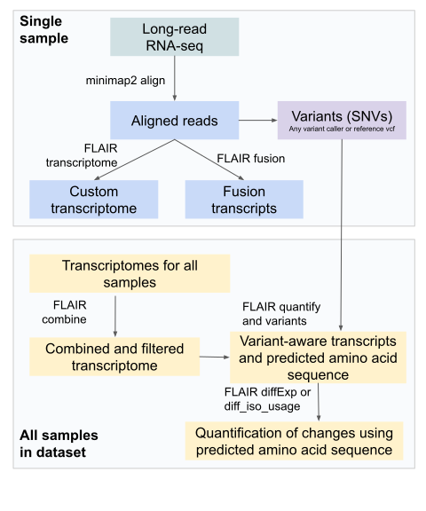

.. _flair-protocol-label:

FLAIR protocol
==============

- Align reads to the genome
- Obtain novel splice junction reference
- Generate transcriptomes
- Combine transcriptomes between samples
- Quantify splicing relative to the combined transcriptome

Aligning reads to the genome
----------------------------

FLAIR is now very flexible about read alignment strategies; please use
whatever makes the most sense for your data. We now recommend aligning
each sample individually. The exception is if your samples have less
than 10M reads. In that case, you may want to combine replicates for
better coverage. However, we have tested and obtained good results with
~1M reads.

- FLAIR align

  - Is a wrapper around minimap that uses specific options for what we
    find to be good spliced alignment; will also do some additional
    filtering if requested
  - Pros: this is what FLAIR was tested on, will provide consistent
    results
  - Cons: this requires FASTA/FASTQ read files, so if your raw reads are
    provided as BAM files, you would need to convert them to
    FASTA/FASTQ, losing information stored in the BAM tags. Also, if
    your reads are already aligned, realigning is cumbersome.

- Pbmm2 / Dorado align

  - These are the minimap2 wrappers developed by PacBio and ONT
  - Pros: will align raw BAM files directly and preserve tags, UMIs, and
    modification information
  - Cons: minimal flexibility in terms of alignment options, less stable
    than minimap (more frequent updates)

- Minimap2

  - This is the basal aligner used by all of these methods, which can
    also be run directly
  - Pros: maximum flexibility and control in terms of alignment options
  - Cons: Similar to FLAIR align
  - Recommended alignment command:

    - ``minimap2 -ax splice -s 40 -G 350k -t 25 --MD --secondary=no GENOME.fa SAMPLE.fa | samtools view -hb - | samtools sort - > SAMPLE.genomealigned.bam; samtools index SAMPLE.genomealigned.bam``
    - If your library is stranded, you may want to add ``-uf`` to the
      minimap2 command (forces splice junctions to be on the same strand
      as the read)

Obtaining novel splice junction reference
-----------------------------------------

FLAIR requires some kind of splice junction reference. Even if you have
a well-annotated reference transcriptome, we highly recommend including
some reference for novel splice junctions. FLAIR will not report any
splice junctions not found in either the reference transcriptome or the
supported junctions file. You can either use short-read junctions (from
paired short-read sequencing or from some other sequencing of the same
tissue type) or calculate supported junctions directly from the
long-read data

- NOTE: We usually recommend that you use the same reference splice
  junctions file for all samples within a dataset, but when that is not
  possible (when the dataset is growing over time), using
  sample-specific files is okay.

  - For combining files between samples, concatenating the files into
    one is fine.

- Using short-read junctions:

  - Pros: provides orthogonal support, minimizes long-read specific
    biases/artifacts
  - Cons: requires additional sequencing, or if non-matched sequencing
    is used, could be less sensitive to sample-specific junctions
  - Usage:

    - Preferred: align short-reads with STAR. STAR will output a
      SJ.out.tab file by default; you can use this file directly with
      the –junction_tab option in FLAIR transcriptome
    - If your short-reads have already been aligned with another
      aligner, you can extract the junctions with the junctions_from_sam
      script included with FLAIR or using
      `intronProspector <https://github.com/diekhans/intronProspector>`__.

- Using long-read junctions:

  - Pros: detects and removes artifacts, direct junction detection from
    the same reads you’re assembling transcripts from (best match)
  - Cons: Potentially less sensitive to rare events with low read
    support, not orthogonal support (has the same lrRNA biases)
  - Usage:

    - After genomic alignment of your reads (have indexed BAM file), use
      intronProspector to generate a junctions.bed file:
    - ``intronProspector --genome-fasta=GENOME.fa --intron-bed6=SAMPLE.IPjunctions.bed -C 0.0 SAMPLE.genomealigned.bam``

Generating transcriptomes
-------------------------

This is the core function of FLAIR. We have recently switched from using
two modules to assemble the transcriptome (correct and collapse) to
using FLAIR transcriptome. This single module allows parallelized
transcriptome building directly from the aligned BAM file, reducing
memory usage and increasing speed. FLAIR transcriptome is also more
sensitive to novel genes and transcripts than previous versions. FLAIR
transcriptome can be run with or without an annotated GTF file, but
having a good reference does improve performance. Here we provide a
standard recommended command, but FLAIR transcriptome has many options
that can be tuned for your application, see its dedicated page to learn
more.

- With short-read orthogonal support:

  - ``flair transcriptome -g GENOME.fa -f ANNOTATION.gtf --junction_tab SHORTREAD.SJ.out.tab -b SAMPLE.genomealigned.bam -o SAMPLE``

- With junctions from long reads:

  - ``flair transcriptome -g GENOME.fa -f ANNOTATION.gtf --junction_bed LONGREAD.IPjunctions.bed --junction_support 2 -b SAMPLE.genomealigned.bam -o SAMPLE``

Combine transcriptomes between samples
--------------------------------------

If you have a dataset composed of many samples that you want to compare,
you want to have a reference transcriptome that works equally well for
all samples. To achieve this, first generate a transcriptome for each
sample or batch of samples. Next, use FLAIR combine to combine the
transcriptomes.

- Make a manifest file pointing to your transcriptomes for all of your
  samples (see FLAIR combine documentation for more details)
- Run FLAIR combine:

  - More stringent combination (keep only spliced isoforms expressed at
    over 10% of the locus in at least 1 sample)

    - ``flair combine -m MANIFEST.txt -o OUTPUT``

  - Less stringent combination (keeps anything supported in any file,
    just combines based on splice junctions and similar ends)

    - ``flair combine -m MANIFEST.txt -o OUTPUT -p 0 -f 1 -s``

Quantify splicing relative to the combined transcriptome
--------------------------------------------------------

For the most consistent transcript quantification, we recommend
re-quantifying all of your samples together on the combined
transcriptome using FLAIR quantify. FLAIR quantify is a stringent
quantification method. It assigns reads to unambiguous transcript
matches and does not support EM or partial support algorithms. This is
excellent for downstream approaches that require unambiguous
read-to-transcript matching and is a stringent quantification method,
but you will likely recover only 55-90% of your reads compared to
gene-level quantification.

- Make a new manifest file pointing to your raw FASTA/FASTQ reads for
  all samples (if your raw reads are in BAM format, you need to convert
  them to FASTA/FASTQ).

  - Read FASTA/FASTQ files, can be gzipped

- Run FLAIR quantify:

  - ``flair quantify -r MANIFEST.txt -i COMBINED.isoforms.fa --isoform_bed COMBINED.isoforms.bed --stringent --check_splice``
