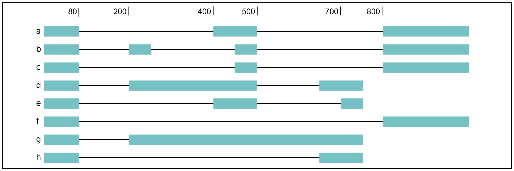

flair diffSplice
================

.. code:: sh

   usage: flair diffSplice -i <isoforms.bed>|<isoforms.psl> -q counts_matrix.tsv [options]

This module calls alternative splicing (AS) events from isoforms. Currently supports
the following AS events: 
 - intron retention (ir)
 - alternative 3’ splicing (alt3)
 - alternative 5’ splicing (alt5)
 - cassette exons (es)

If there are 3 or more samples per condition, then you can run with
``--test`` and DRIMSeq will be used to calculate differential usage of
the alternative splicing events between two conditions. See below for
more DRIMSeq-specific arguments. 

If conditions were sequenced without replicates, then the flair-diffSplice output files can
be input to the `diffsplice_fishers_exact.py <#diffsplice_fishers>`__
script for statistical testing instead.

Outputs

After the run, the output directory (``--out_dir``) contains the following tab separated files:
 - ``diffsplice.alt3.events.quant.tsv``
 - ``diffsplice.alt5.events.quant.tsv``
 - ``diffsplice.es.events.quant.tsv``
 - ``diffsplice.ir.events.quant.tsv``
If DRIMSeq was run (where ``A`` and ``B`` are conditionA and conditionB, see below):
 - ``drimseq_alt3_A_v_B.tsv``
 - ``drimseq_alt5_A_v_B.tsv``
 - ``drimseq_es_A_v_B.tsv``
 - ``drimseq_ir_A_v_B.tsv``
 - ``workdir`` Temporary files including unfiltered output files.

Options
-------

Required arguments
~~~~~~~~~~~~~~~~~~
``--isoforms`` Isoforms in bed or psl format from the ``flair collapse`` module

``--counts_matrix`` Tab-delimited isoform count matrix from the ``flair quantify`` module

``--out_dir`` Output directory for tables and plots.

Optional arguments
~~~~~~~~~~~~~~~~~~
``--help`` Show all options.

``--test`` Run DRIMSeq statistical testing.

``--threads`` Number of processors to use (default 4).

``--drim1`` The minimum number of samples that have coverage over an AS event inclusion/exclusion for DRIMSeq testing; events with too few samples are filtered out and not tested (6).

``--drim2`` The minimum number of samples expressing the inclusion of an AS event; events with too few samples are filtered out and not tested (3).

``--drim3`` The minimum number of reads covering an AS event inclusion/exclusion for DRIMSeq testing, events with too few samples are filtered out and not tested (15).

``--drim4`` The minimum number of reads covering an AS event inclusion for DRIMSeq testing, events with too few samples are filtered out and not tested (5).

``--batch`` If specified with --test, DRIMSeq will perform batch correction.

``--conditionA`` Specify one condition corresponding to samples in the counts_matrix to be compared against condition2; by default, the first two unique conditions are used. **This implies ``--test``.**

``--conditionB`` Specify another condition corresponding to samples in the counts_matrix to be compared against conditionA.

``--out_dir_force`` Specify this argument to force overwriting of files in an existing output directory

Notes
-----

Results tables are filtered and reordered by p-value so that only p<0.05 differential genes/isoforms remain. Unfiltered tables can be found in ``workdir``

For a complex splicing example, please note the 2 alternative 3’ SS, 3
intron retention, and 4 exon skipping events in the following set of
isoforms that flair-diffSplice would call and the isoforms that are
considered to include or exclude the each event:

.. code::

   a3ss_feature_id     coordinate                  sample1 sample2 ... isoform_ids
   inclusion_chr1:80   chr1:80-400_chr1:80-450     75.0    35.0    ... a,e
   exclusion_chr1:80   chr1:80-400_chr1:80-450     3.0     13.0    ... c
   inclusion_chr1:500  chr1:500-650_chr1:500-700   4.0     18.0    ... d
   exclusion_chr1:500  chr1:500-650_chr1:500-700   70.0    17.0    ... e

.. code::

   ir_feature_id           coordinate      sample1 sample2 ... isoform_ids
   inclusion_chr1:500-650  chr1:500-650    46.0    13.0    ... g
   exclusion_chr1:500-650  chr1:500-650    4.0     18.0    ... d
   inclusion_chr1:500-700  chr1:500-700    46.0    13.0    ... g
   exclusion_chr1:500-700  chr1:500-700    70.0    17.0    ... e
   inclusion_chr1:250-450  chr1:250-450    50.0    31.0    ... d,g
   exclusion_chr1:250-450  chr1:250-450    80.0    17.0    ... b

.. code::

   es_feature_id           coordinate      sample1 sample2 ... isoform_ids
   inclusion_chr1:450-500  chr1:450-500    83.0    30.0    ... b,c
   exclusion_chr1:450-500  chr1:450-500    56.0    15.0    ... f
   inclusion_chr1:200-250  chr1:200-250    80.0    17.0    ... b
   exclusion_chr1:200-250  chr1:200-250    3.0     13.0    ... c
   inclusion_chr1:200-500  chr1:200-500    4.0     18.0    ... d
   exclusion_chr1:200-500  chr1:200-500    22.0    15.0    ... h
   inclusion_chr1:400-500  chr1:400-500    75.0    35.0    ... e,a
   exclusion_chr1:400-500  chr1:400-500    56.0    15.0    ... f

