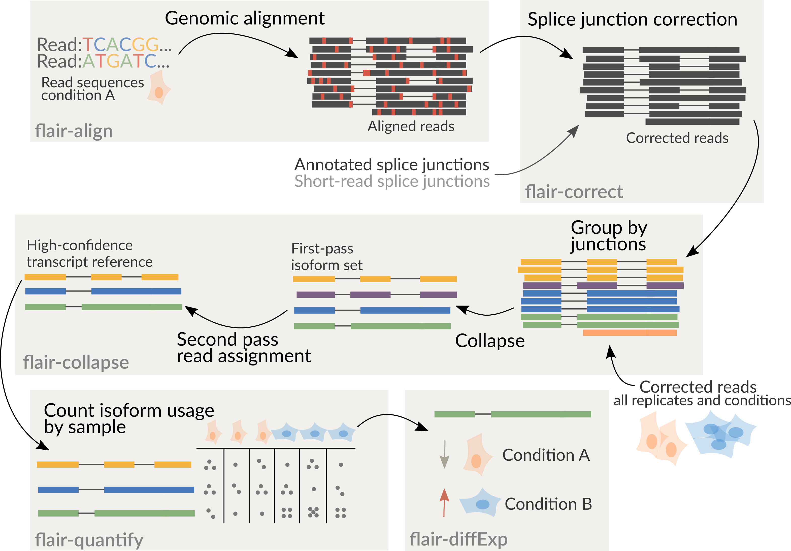

.. Flair documentation master file, created by
   sphinx-quickstart on Fri Jul  8 08:42:03 2022.
   You can adapt this file completely to your liking, but it should at least
   contain the root `toctree` directive.

Welcome to Flair's documentation!
=================================

New: Flair can now be conda installed using 

.. code:: sh

   conda create -n flair -c conda-forge -c bioconda flair
   conda activate flair

FLAIR can be run optionally with short-read data to help increase splice
site accuracy of the long read splice junctions. FLAIR uses multiple
alignment steps and splice site filters to increase confidence in the
set of isoforms defined from noisy data. FLAIR was designed to be able
to sense subtle splicing changes in nanopore data from `Tang et
al. (2020) <https://www.nature.com/articles/s41467-020-15171-6>`__.
Please read for more description of the methods.

It is recommended to combine all samples together prior to running
flair-collapse for isoform assembly by concatenating corrected read
``psl`` or ``bed`` files together. Following the creation of an isoform
reference from flair-collapse, consequent steps will assign reads from
each sample individually to isoforms of the combined assembly for
downstream analyses.

It is also good to note that ``bed12`` and ``psl`` can be converted
using
`kentUtils <https://github.com/ENCODE-DCC/kentUtils/tree/master/src/hg/utils>`__
bedToPsl or pslToBed, or using ``bed_to_psl`` and
``psl_to_bed`` provided in flair's ``/bin`` directory.

.. toctree::
   :maxdepth: 2
   :caption: Contents:

   requirements.rst
   modules.rst
   scripts.rst
   flair2_functions.rst
   other_ways.rst
   other_environments.rst
   testrun.rst
   example_files.rst
   faqs.rst
   cite.rst

Indices and tables
==================

* :ref:`genindex`
* :ref:`modindex`
* :ref:`search`
