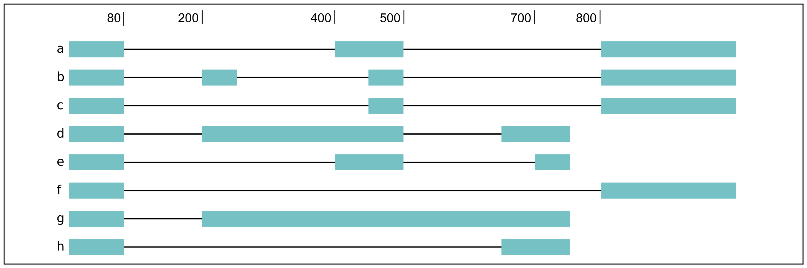

FLAIR modules
=============

``flair.py`` is a wrapper script with modules for running various
processing scripts located in ``bin/``. Modules are assumed to be run in
order (align, correct, collapse), but the user can forgo the wrapper if
a more custom build is desired.

.. _align-label:

flair align
~~~~~~~~~~~

Aligns reads to the genome using minimap2, and converts the aligned
minimap2 ``sam`` output to
`BED12 <https://genome.ucsc.edu/FAQ/FAQformat.html#format14>`__ and
optionally `PSL <https://genome.ucsc.edu/FAQ/FAQformat.html#format2>`__.
Aligned reads in ``psl`` format can be visualized in IGV or the UCSC
Genome browser. As for which human reference genome to use, Heng Li has
written a `blog
post <https://lh3.github.io/2017/11/13/which-human-reference-genome-to-use>`__
on this.

Alternatively, the user can align the reads themselves with their
aligner of choice and convert sorted ``bam`` output to ``bed12`` using
``bin/bam2Bed12.py`` to supply for flair-correct. This step smooths gaps
in the alignment.

**Usage:**

.. code:: sh

   python flair.py align -g genome.fa -r <reads.fq.gz>|<reads.fq>|<reads.fa> [options]

run with ``--help`` for a description of optional arguments. Outputs (1)
``sam`` of raw aligned reads and (2) smoothed ``bed12`` file of aligned
reads to be supplied to flair-correct.

.. _correct-label:

flair correct
~~~~~~~~~~~~~

Corrects misaligned splice sites using genome annotations and/or
short-read splice junctions. Based on common user issues we have
encountered, for flair-correct to run properly, please ensure/note that
(1) the genome annotation and genome sequences are compatible, (2)
``gtf`` is preferred over ``gff`` for annotation and annotations that do
not split single exons into multiple entries are ideal, (3) Bedtools is
in your $PATH, and (4) kerneltree is properly installed (you may need to
install Cython first). You may also want to refer to the `installation
requirements <#requirements>`__ and/or use the `conda
environment <#condaenv>`__ for flair.

**Usage:**

.. code:: sh

   python flair.py correct -q query.bed12 -g genome.fa [options]

run with ``--help`` for description of optional arguments. Outputs (1)
``bed12`` of corrected reads, (2) ``bed12`` of reads that weren’t able
to be corrected, (3) ``psl`` of corrected reads if the -c chromsizes
file is provided. Either (1) or (3) can be supplied to flair-collapse as
the query.

Short-read junctions
^^^^^^^^^^^^^^^^^^^^

To use short-read splice sites to aid with correction, one option is
``bin/junctions_from_sam.py`` to extract splice junctions from
short-read alignments. The ``-s`` option accepts either ``sam`` or
``bam`` files, and if there are multiple sams/bams they can be provided
in a comma-separated list.

**Usage:**

.. code:: sh

   python junctions_from_sam.py -s <shortreads.sam>|<shortreads.bam> -n outname

The file that can be supplied to flair-correct with ``-j`` is in the
output file ``outname_junctions.bed``. It is recommended that the user
remove infrequently used junctions i.e. junctions with few supporting
junction reads, which are in the 5th column of the junction bed file.
For example, if you wanted to do the filter out junctions with fewer
than 3 supporting short reads, you could use
``awk '{ if ($5 > 2) { print } }' outname.sj_junctions.bed > outname.filtered.bed``.

Alternatively, the ``-j`` argument for flair-correct can also be
generated using STAR. STAR 2-pass alignment of short reads automatically
produces a compatible splice junction file (``SJ.out.tab``). We
recommend filtering out junctions with few uniquely mapping reads
(column 7).

.. _collapse-label:

flair collapse
~~~~~~~~~~~~~~

Defines high-confidence isoforms from corrected reads. As FLAIR does not
use annotations to collapse isoforms, FLAIR will pick the name of a read
that shares the same splice junction chain as the isoform to be the
isoform name. It is recommended to still provide an annotation with
``-f``, which is used to rename FLAIR isoforms that match isoforms in
existing annotation according to the transcript_id field in the gtf.
Intermediate files generated by this step are removed by default, but
can be retained for debugging purposes by supplying the argument
``--keep_intermediate`` and optionally supplying a directory to keep
those files with ``--temp_dir``.

If there are multiple samples to be compared, the flair-corrected read
``bed`` or ``psl`` files should be concatenated prior to running
flair-collapse. In addition, all raw read fastq/fasta files should
either be specified after ``-r`` with space/comma separators or
concatenated into a single file.

**Usage:**

.. code:: sh

   python flair.py collapse -g genome.fa -r <reads.fq>|<reads.fa> -q <query.psl>|<query.bed> [options]

run with ``--help`` for description of optional arguments.

Outputs the high-confidence isoforms in several formats: (1)
``*isoforms.psl`` or ``.bed``, (2) ``*isoforms.gtf``, as well as (3) an
``*isoforms.fa`` file of isoform sequences. If an annotation file is
provided, the isoforms ID format will contain the transcript id,
underscore, and then the gene id, so it would look like ``ENST*_ENSG*``
if you’re working with the GENCODE human annotation. If multiple
TSSs/TESs are allowed (toggle with ``--max_ends`` or
``--no_redundant``), then a ``-1`` or higher will be appended to the end
of the isoform name for the isoforms that have identical splice junction
chains and differ only by their TSS/TES. For the gene field, the gene
that is assigned to the isoform is based on whichever annotated gene has
the greatest number of splice junctions shared with the isoform. If
there are no genes in the annotation which can be assigned to the
isoform, a genomic coordinate is used (e.g. ``chr*:100000``).

.. _quantify-label:

flair quantify
~~~~~~~~~~~~~~

Convenience function to quantifying FLAIR isoform usage across samples
using minimap2. If isoform quantification in TPM is desired, please use
the ``--tpm`` option. If the user prefers
`salmon <https://combine-lab.github.io/salmon/getting_started/>`__ to
quantify transcripts using their nanopore reads, please specify a path
to salmon using ``--salmon``. For all options run flair-quantify with
``--help``.

**Usage:**

.. code:: sh

   python flair.py quantify -r reads_manifest.tsv -i isoforms.fasta [options]

**Inputs:**  

1. ``reads_manifest.tsv`` is a tab-delimited file
containing the sample name, condition, batch*, and path to reads.fq/fa.
For example::

   sample1 conditionA  batch1  ./sample1_reads.fq
   sample2 conditionA  batch1  ./sample2_reads.fq
   sample3 conditionA  batch2  ./sample3_reads.fq
   sample4 conditionB  batch1  ./sample4_reads.fq
   sample5 conditionB  batch1  ./sample5_reads.fq
   sample6 conditionB  batch2  ./sample6_reads.fq

\* The batch descriptor is used in the downstream flair-diffExp analysis
to model unintended variability due to secondary factors such as batch
or sequencing replicate. If unsure about this option, leave this column
defined as ``batch1`` for all samples.

2. ``isoforms.fasta`` contains FLAIR collapsed isoforms produced by the
:ref:`collapse-label` module.

**Outputs:**\  (1) ``counts_matrix.tsv`` which is a tab-delimited file
containing isoform counts for each sample. In the output, the values in
the manifest file are concatenated with underscores so please do not use
underscores in the manifest file. For example::

   ids samp1_conditionA_batch1 samp2_conditionA_batch1 samp3_conditionA_batch2 ...
   0042c9e7-b993_ENSG00000131368.3 237.0   156.0   165.0   150.0   ...
   0042d216-6b08_ENSG00000101940.13    32.0    14.0    25.0    ...

.. _diffExp-label:

flair diffExp
~~~~~~~~~~~~~

Performs differential isoform expression, differential gene expression,
and differential isoform usage analyses between multiple samples with 3
or more replicates. For differential isoform usage analysis between
samples without replicates, please use the
`diff_iso_usage.py <#diffisoscript>`__ standalone script. This module
requires additional python modules and R packages which are described
below:

Additional Requirements
^^^^^^^^^^^^^^^^^^^^^^^

1. python v2.7+ and python modules: pandas, numpy, rpy2
2. `DESeq2 <https://bioconductor.org/packages/release/bioc/html/DESeq2.html>`__
3. `ggplot2 <https://ggplot2.tidyverse.org>`__
4. `qqman <https://cran.r-project.org/web/packages/qqman/index.html>`__
5. `DRIMSeq <http://bioconductor.org/packages/release/bioc/html/DRIMSeq.html>`__
6. `stageR <http://bioconductor.org/packages/release/bioc/html/stageR.html>`__

**Usage:**

.. code:: sh

   python flair.py diffExp -q counts_matrix.tsv -o output_directory [options]

**Inputs:**\  (1) ``counts_matrix.tsv`` is a tab-delimited file
generated by the :ref:`quantify-label` module.

**Outputs:**\  (1) Files contained in the ``output_directory`` are
tables and plots generated from the various R-packages used in this
analysis, including raw DESeq2/DRIMSeq output tables with foldChange,
isoform frequency and adjusted pvalues.

.. _diffSplice-label:

flair diffSplice
~~~~~~~~~~~~~~~~

Calls alternative splicing events from isoforms. Currently we support
the following AS events: intron retention, alternative 3’ splicing,
alternative 5’ splicing, and cassette exons.

**Usage:**

.. code:: sh

   python flair.py diffSplice -i <isoforms.bed>|<isoforms.psl> -q counts_matrix.tsv [options]

If there are 3 or more samples per condition, then the user can run with
``--test`` and DRIMSeq will be used to calculate differential usage of
the alternative splicing events between two conditions. Run with
``--help`` to see more DRIMSeq-specific arguments. If conditions were
sequenced without replicates, then the flair-diffsplice output files can
be input to the `diffsplice_fishers_exact.py <#diffsplice_fishers>`__
script for statistical testing instead.

**Inputs:**\  (1) ``-i`` is a tab-delimited isoforms.bed/psl file
generated by the ```flair-collapse`` :ref:`collapse-label` module.
(2) ``-q`` is a tab-delimited counts_matrix.tsv file generated by the
:ref:`quantify-label` module.

**Outputs:**\  (1-4) 4 tab-delimited files for each AS event type. If
DRIMSeq was run, and a file with PSIs for each sample and the
corresponding p-values for each event type (5-8).

For a complex splicing example, please note the 2 alternative 3’ SS, 3
intron retention, and 4 exon skipping events in the following set of
isoforms that flair-diffSplice would call and the isoforms that are
considered to include or exclude the each event:



.. code::

   a3ss_feature_id     coordinate                  sample1 sample2 ... isoform_ids
   inclusion_chr1:80   chr1:80-400_chr1:80-450     75.0    35.0    ... a,e
   exclusion_chr1:80   chr1:80-400_chr1:80-450     3.0     13.0    ... c
   inclusion_chr1:500  chr1:500-650_chr1:500-700   4.0     18.0    ... d
   exclusion_chr1:500  chr1:500-650_chr1:500-700   70.0    17.0    ... e

.. code::

   ir_feature_id           coordinate      sample1 sample2 ... isoform_ids
   inclusion_chr1:500-650  chr1:500-650    46.0    13.0    ... g
   exclusion_chr1:500-650  chr1:500-650    4.0     18.0    ... d
   inclusion_chr1:500-700  chr1:500-700    46.0    13.0    ... g
   exclusion_chr1:500-700  chr1:500-700    70.0    17.0    ... e
   inclusion_chr1:250-450  chr1:250-450    50.0    31.0    ... d,g
   exclusion_chr1:250-450  chr1:250-450    80.0    17.0    ... b

.. code::

   es_feature_id           coordinate      sample1 sample2 ... isoform_ids
   inclusion_chr1:450-500  chr1:450-500    83.0    30.0    ... b,c
   exclusion_chr1:450-500  chr1:450-500    56.0    15.0    ... f
   inclusion_chr1:200-250  chr1:200-250    80.0    17.0    ... b
   exclusion_chr1:200-250  chr1:200-250    3.0     13.0    ... c
   inclusion_chr1:200-500  chr1:200-500    4.0     18.0    ... d
   exclusion_chr1:200-500  chr1:200-500    22.0    15.0    ... h
   inclusion_chr1:400-500  chr1:400-500    75.0    35.0    ... e,a
   exclusion_chr1:400-500  chr1:400-500    56.0    15.0    ... f

