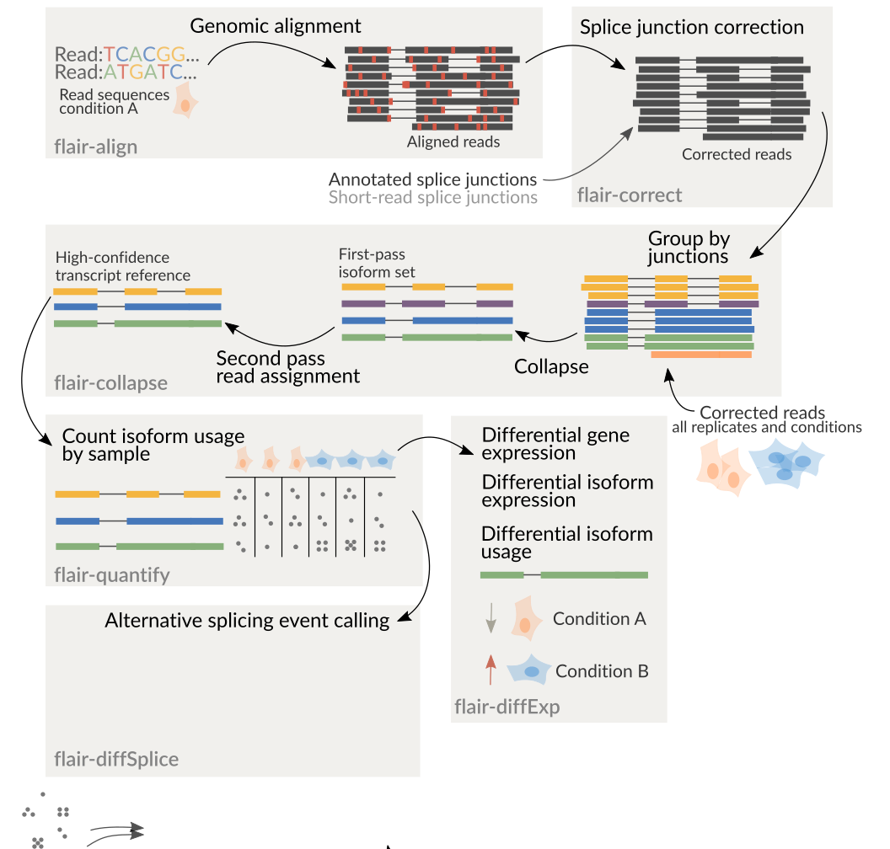
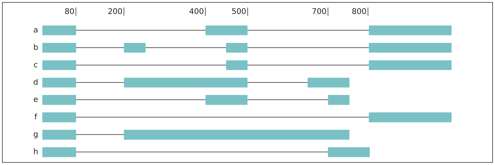

Modules
^^^^^^^

``flair`` is a program which implement the follow module sub-commands.

If you want to compare multiple samples, there are two primary ways of doing this:
 - Combine the fastq or fasta reads of all samples and run FLAIR transcriptome on all samples together (will generate the most comprehensive transcriptome)
 - Run FLAIR transcriptome on each sample separately (better for large sets of samples) and
   use FLAIR combine to merge results

.. _transcriptome-label:

flair transcriptome
===================

This module generates a transcriptome of high confidence isoforms (bed, gtf, and fasta files) directly from a bam file of aligned reads.
To get aligned reads, you can use FLAIR align or just run the following command to generate the bam file to use as input.
minimap2 -ax splice -s 80 -G 200k -t 20 --secondary=no genome.fa sample.fastq | samtools view -hb - | samtools sort - > sample.genomealigned.bam; samtools index sample.genomealigned.bam
If you want to run downstream fusion detection with FLAIR fusion, run flair align with --filter_type separate to generate a separate file of chimeric alignments.

**Outputs**

 - ``flair.isoforms.bed``
 - ``flair.isoforms.gtf``
 - ``flair.isoforms.fa``
 - ``flair.read.map.txt``

Options
-------

.. include:: cli/transcriptome.rst

.. _align-label:

flair align
===========

Use of this modules is deprecated, as ``FLAIR transcriptome`` operates on a BAM, and other output of ``flair align`` is no longer used.

This module aligns reads to the genome using `minimap2 <https://github.com/lh3/minimap2>`__, 
and converts the `SAM <https://en.wikipedia.org/wiki/SAM_(file_format)>`__ output to `BED12 <https://genome.ucsc.edu/FAQ/FAQformat.html#format14>`__.
Aligned reads in BED12 format can be visualized in `IGV <https://igv.org/>`__ or the 
`UCSC Genome browser <https://genome.ucsc.edu/cgi-bin/hgGateway>`__. 

**Outputs**

 - ``flair.aligned.bam``
 - ``flair.aligned.bam.bai``
 - ``flair.aligned.bed``

Options
-------

.. include:: cli/align.rst

Notes
-----
If you're using human sequences, the best reference genome is 
`GCA_000001405.15_GRCh38_no_alt_analysis_set <ftp://ftp.ncbi.nlm.nih.gov/genomes/all/GCA/000/001/405/GCA_000001405.15_GRCh38/seqs_for_alignment_pipelines.ucsc_ids/GCA_000001405.15_GRCh38_no_alt_analysis_set.fna.gz>`__ as described in this 
`helpful blog post by Heng Li <https://lh3.github.io/2017/11/13/which-human-reference-genome-to-use>`__

If your input sequences are Oxford nanopore reads, please use `Pychopper <https://github.com/epi2me-labs/pychopper>`__ before running Flair.

nvrna settings: See `minimap2's manual <https://lh3.github.io/minimap2/minimap2.html>`__ for details.

quality: `More info on MAPQ scores <http://www.acgt.me/blog/2014/12/16/understanding-mapq-scores-in-sam-files-does-37-42>`__ 

.. _fusions-label:

flair fusion
============

This identifies gene fusions and generates a fusion transcriptome. 
To incorporate this fusion transcriptome in downstream analysis, 
use flair combine to merge it with normal isoforms. 

**Output**

sample.fusions.isoforms.bed
    Bed file of fusion transcriptome (each fusion has a line for each locus in the fusion, 
    and position in the fusion is specified by the fusiongeneX prefix in the name field
sample.fusions.isoforms.fa
    Fasta file of fusion transcriptome
sample.syntheticAligned.isoform.read.map
    read map of reads to fusion isoforms

Options
-------

.. include:: cli/fusion.rst

.. _combine-label:

flair combine
=============

Combines FLAIR transcriptomes with other FLAIR transcriptomes or annotation
transcriptomes to generate an accurate combined transcriptome. The transcriptomes to
combine are named in one of three mutually exclusive ways: --manifest, --prefixes or
--isoform_beds.

Manifest example, one bed file path per line (we suggest using absolute file paths to
point to your files though):

.. code:: text

    sample1.FLAIR.isoforms.bed
    sample2.FLAIR.isoforms.bed
    sample1.fusion.isoforms.bed
    sample2.fusion.isoforms.bed

To combine FLAIR transcriptomes with annotated transcripts, convert the annotation gtf
to a bed file with gtf_to_bed (see Additional Programs) and name that bed here.

Flair combine will generate a counts file, but for the most accurate quantification, we recommend 
running FLAIR quantify using all samples against the combined transcriptome

Options
-------

.. include:: cli/combine.rst

.. _quantify-label:

flair quantify
==============

**Output**

Default: identifes the best isoform assignment based on alignment quality, fraction of read aligned, and fraction of transcript aligned

check_splice: adds check for read matching reference transcript at all splice sites

stringent: adds requirement for read to cover at least 25bp of the first and last exons

If you need your reads to match your isoforms well, use --check_splice and --stringent, while if you need more reads assigned to isoforms for better statistical comparison, use the default.

--quality 0 is also reccommended, as this allows slightly better recall as FLAIR can disambiguate some similar isoform alignments.

Options
-------

Manifest example (we suggest using absolute file paths to point to your files though):

.. code:: text

   sample1      condition1      batch1  mydata/sample1.bam
   sample2      condition1      batch1  mydata/sample2.bam
   sample3      condition1      batch1  mydata/sample3.bam
   sample4      condition2      batch1  mydata/sample4.bam
   sample5      condition2      batch1  mydata/sample5.bam
   sample6      condition2      batch1  mydata/sample6.bam

.. include:: cli/quantify.rst

Other info
----------
The counts file names each column after the sample it holds:

.. code:: text

   ids  sample1 sample2 sample3 sample4 sample5 sample6
   ENST00000225792.10_ENSG00000108654.15   21.0    12.0    10.0    10.0    14.0    13.0
   ENST00000256078.9_ENSG00000133703.12    7.0     6.0     7.0     15.0    12.0    7.0

The condition and batch of each column are in ``<output>.sample_info.tsv``, written
beside the counts file, which `flair diffexp` and `flair diffsplice` read:

.. code:: text

   sample_id    condition       batch
   sample1      condition1      batch1
   sample2      condition1      batch1
   sample3      condition1      batch1
   sample4      condition2      batch1
   sample5      condition2      batch1
   sample6      condition2      batch1

Because these are columns of their own, the id, condition and batch fields may
contain any characters. A counts matrix from an earlier FLAIR, whose columns are
named ``sample_condition_batch``, is still read by taking the fields back out of the
column name.

.. _diffexp-label:

flair diffexp
=============

The standard `conda` environment no long installed `R` and the required packages.
These maybe added do the environment as describe in :ref:`installing-label` 

This module performs differential *expression* and differential *usage* analyses between **exactly two** conditions with 
3 or more replicates. Name the two conditions with ``--condition_a`` and ``--condition_b``;
``--condition_a`` is the reference, so fold changes are reported for ``--condition_b``
relative to it. With neither given, the two conditions are used in sorted order, which
makes the control the reference when its name sorts first (eg ctl and test). It does so
by running these R packages:

 - `DESeq2 <https://bioconductor.org/packages/release/bioc/html/DESeq2.html>`__ on genes and isoforms. This tests for differential expression.
 - `DRIMSeq <http://bioconductor.org/packages/release/bioc/html/DRIMSeq.html>`__ is used on isoforms only and tests for differential usage. This is done by testing if the ratio of isoforms changes between conditions.

If you do not have replicates you can use the `diff_iso_usage <#diffisoscript>`__ standalone script.

If you have more than two sample condtions, either split your counts matrix ahead of time or run DESeq2 and DRIMSeq yourself. 

**Outputs**

After the run, the output directory (``--output``) contains the following, where ``A``
is ``--condition_a`` and ``B`` is ``--condition_b``. Fold changes are reported for
``B`` relative to ``A``, so naming the conditions the other way round negates them
and renames these files.

 - ``genes_deseq2_A_v_B.tsv`` Filtered differential gene expression table.
 - ``genes_deseq2_QCplots_A_v_B.pdf`` QC plots, see the `DESeq2 manual <https://bioconductor.org/packages/release/bioc/vignettes/DESeq2/inst/doc/DESeq2.html>`__ for details.
 - ``isoforms_deseq2_A_v_B.tsv`` Filtered differential isoform expression table.
 - ``isoforms_deseq2_QCplots_A_v_B.pdf`` QC plots
 - ``isoforms_drimseq_A_v_B.tsv`` Filtered differential isoform usage table
 - ``isoforms_sig_exp_change_norm_by_gene.tsv`` Isoforms whose usage changes, from a t-test on counts normalized by gene.
 - ``workdir`` Temporary files including unfiltered output files.

Options
-------

.. include:: cli/diffexp.rst

Notes
-----

DESeq2 and DRIMSeq are optimized for short read experiments and expect many reads for each expressed gene. Lower coverage (as expected when using long reads) will tend to result in false positives.

For instance, look at this counts table with two groups (s and v) of three samples each:

.. code:: text

    gene   s1    s2      s3      v1      v2      v3
       A    1     0       2       0       4       2
       B  100    99     101     100     104     102

Gene A has an average expression of 1 in group s, and 2 in group v but the total variation in read count is 0-4. The same variation is true for gene B, but it will not be considered differentially expressed.

Flair does not remove low count genes as long as they are expressed in all samples of at least one group so please be careful when interpreting results.

Results tables are filtered and reordered by p-value so that only p<0.05 differential genes/isoforms remain. Unfiltered tables can be found in ``workdir``

.. _diffsplice-label:

flair diffsplice
================

The standard `conda` environment no long installed `R` and the required packages.
These maybe added do the environment as describe in :ref:`installing-label` 

This module calls alternative splicing (AS) events from isoforms. Currently supports
the following AS events: 

 - intron retention (ir)
 - alternative 3’ splicing (alt3)
 - alternative 5’ splicing (alt5)
 - cassette exons (es)

If there are 3 or more samples per condition, then you can run with
``--test`` and DRIMSeq will be used to calculate differential usage of
the alternative splicing events between two conditions. See below for
more DRIMSeq-specific arguments. 

If conditions were sequenced without replicates, then the diffSplice output files can
be input to the `diffsplice_fishers_exact <#diffsplice_fishers>`__
script for statistical testing instead.

**Outputs**

After the run, the output directory (``--output``) contains the following tab separated files:

 - ``diffsplice.alt3.events.quant.tsv``
 - ``diffsplice.alt5.events.quant.tsv``
 - ``diffsplice.es.events.quant.tsv``
 - ``diffsplice.ir.events.quant.tsv``

If DRIMSeq was run, where ``A`` is ``--condition_a`` and ``B`` is ``--condition_b``:

 - ``drimseq_alt3_A_v_B.tsv``
 - ``drimseq_alt5_A_v_B.tsv``
 - ``drimseq_es_A_v_B.tsv``
 - ``drimseq_ir_A_v_B.tsv``
 - ``workdir`` Temporary files including unfiltered output files.

Options
-------

.. include:: cli/diffsplice.rst

Notes
-----

Results tables are filtered and reordered by p-value so that only p<0.05 differential genes/isoforms remain. Unfiltered tables can be found in ``workdir``

For a complex splicing example, please note the 2 alternative 3’ SS, 3
intron retention, and 4 exon skipping events in the following set of
isoforms that ``flair diffSplice`` would call and the isoforms that are
considered to include or exclude the each event:

.. code::

   a3ss_feature_id     coordinate                  sample1 sample2 ... isoform_ids
   inclusion_chr1:80   chr1:80-400_chr1:80-450     75.0    35.0    ... a,e
   exclusion_chr1:80   chr1:80-400_chr1:80-450     3.0     13.0    ... c
   inclusion_chr1:500  chr1:500-650_chr1:500-700   4.0     18.0    ... d
   exclusion_chr1:500  chr1:500-650_chr1:500-700   70.0    17.0    ... e

.. code::

   ir_feature_id           coordinate      sample1 sample2 ... isoform_ids
   inclusion_chr1:500-650  chr1:500-650    46.0    13.0    ... g
   exclusion_chr1:500-650  chr1:500-650    4.0     18.0    ... d
   inclusion_chr1:500-700  chr1:500-700    46.0    13.0    ... g
   exclusion_chr1:500-700  chr1:500-700    70.0    17.0    ... e
   inclusion_chr1:250-450  chr1:250-450    50.0    31.0    ... d,g
   exclusion_chr1:250-450  chr1:250-450    80.0    17.0    ... b

.. code::

   es_feature_id           coordinate      sample1 sample2 ... isoform_ids
   inclusion_chr1:450-500  chr1:450-500    83.0    30.0    ... b,c
   exclusion_chr1:450-500  chr1:450-500    56.0    15.0    ... f
   inclusion_chr1:200-250  chr1:200-250    80.0    17.0    ... b
   exclusion_chr1:200-250  chr1:200-250    3.0     13.0    ... c
   inclusion_chr1:200-500  chr1:200-500    4.0     18.0    ... d
   exclusion_chr1:200-500  chr1:200-500    22.0    15.0    ... h
   inclusion_chr1:400-500  chr1:400-500    75.0    35.0    ... e,a
   exclusion_chr1:400-500  chr1:400-500    56.0    15.0    ... f

.. _variantquant-label:

flair variantquant
==================

Quantifies variants at genome positions using reads aligned to the transcriptome.
Sites to check are named either with a vcf, with a reference position file, or per
sample through a manifest.

Options
-------

.. include:: cli/variantquant.rst

.. _alleles-label:

flair alleles
=============

Calls alleles from variants and groups the reads that carry them, writing a vcf of
allele groups.  A normal bam and vcf may be given alongside the tumor ones to call
variants as somatic or not.

Options
-------

.. include:: cli/alleles.rst

.. _isoalleles-label:

flair isoalleles
================

Groups alleles by isoform, using the allele calls from flair alleles together with an
isoform bed, and predicts the protein each isoform allele produces.

Options
-------

.. include:: cli/isoalleles.rst
