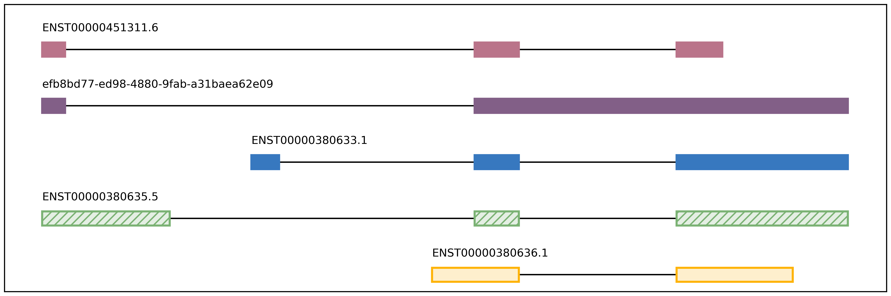
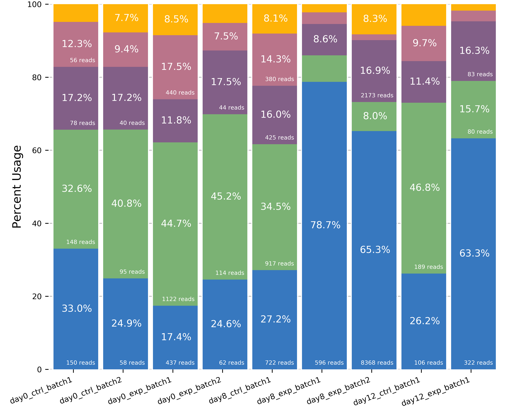

Additional programs
^^^^^^^^^^^^^^^^^^^
When you ``conda install`` flair, the following helper programs will be in your $PATH:

collapse_bed_files
==================
.. code:: sh

usage: flair_combine [-h] -m MANIFEST [-o OUTPUT_PREFIX] [-w ENDWINDOW]
                     [-p MINPERCENTUSAGE] [-c] [-s] [-f FILTER]

options:
  -h, --help            show this help message and exit
  -m MANIFEST, --manifest MANIFEST
                        path to manifest files that points to transcriptomes to combine.
                        Each line of file should be tab separated with sample name, sample
                        type (isoform or fusionisoform), path/to/isoforms.bed,
                        path/to/isoforms.fa, path/to/combined.isoform.read.map.txt. fa and
                        read.map.txt files are not required, although if .fa files are not
                        provided for each sample a .fa output will not be generated
  -o OUTPUT_PREFIX, --output_prefix OUTPUT_PREFIX
                        path to collapsed_output.bed file. default: 'collapsed_flairomes'
  -w ENDWINDOW, --endwindow ENDWINDOW
                        window for comparing ends of isoforms with the same intron chain.
                        Default:200bp
  -p MINPERCENTUSAGE, --minpercentusage MINPERCENTUSAGE
                        minimum percent usage required in one sample to keep isoform in
                        combined transcriptome. Default:10
  -c, --convert_gtf     [optional] whether to convert the combined transcriptome bed file
                        to gtf
  -s, --include_se      whether to include single exon isoforms. Default: dont include
  -f FILTER, --filter FILTER
                        type of filtering. Options: usageandlongest(default), usageonly,
                        none, or a number for the total count of reads required to call an
                        isoform

Combines FLAIR transcriptomes or with other FLAIR transcriptomes or annotation transcriptomes to generate accurate combined transcriptome. Only the manifest file is required. Manifest file is in the following format:

.. code:: text

   sample1      /path/to/sample1.FLAIR.isoforms.bed      /path/to/sample1.FLAIR.combined.isoform.read.map.txt
   sample2      /path/to/sample2.FLAIR.isoforms.bed      /path/to/sample2.FLAIR.combined.isoform.read.map.txt
   refanno      /path/to/refannotranscripts.bed

For each line, the sample name and bed path is required, but the read.map.txt file is optional. Without the read.map.txt file, we have less ability to filter and more isoforms will be included. If a sample is a FLAIR run, we highly reccommend including the read.map.txt file. If you want to combine FLAIR transcriptomes with annotatated transcripts, you can convert an annotation gtf file to a bed file using 

bed_to_gtf
==========

.. code:: sh
    bed_to_gtf file.gtf > file.bed

Convert a BED file to a minimal GTF.
    
diff_iso_usage
==============
.. code:: sh

    usage: diff_iso_usage counts_matrix colname1 colname2 diff_isos.txt

Calculates the usage of each isoform as a fraction of the total expression of the gene and compares this between samples.

Requires four positional arguments to identify and calculate
significance of alternative isoform usage between two samples using
Fisher’s exact tests: (1) counts_matrix.tsv from flair-quantify, (2) the
name of the column of the first sample, (3) the name of the column of
the second sample, (4) ``txt`` output filename containing the p-value
associated with differential isoform usage for each isoform. The more
differentially used the isoforms are between the first and second
condition, the lower the p-value.

Output file format columns are as follows: 

 - gene name
 - isoform name
 - p-value
 - sample1 isoform count
 - sample2 isoform count
 - sample1 alternative isoforms for gene count
 - sample2 alternative isoforms for gene count

diffsplice_fishers_exact
========================
.. code:: sh

    usage: diffsplice_fishers_exact events.quant.tsv colname1 colname2 out.fishers.tsv

Identifies and calculates the significance of alternative splicing
events between two samples without replicates using Fisher’s exact
tests. Requires four positional arguments: (1) flair-diffSplice ``tsv``
of alternative splicing calls for a splicing event type, (2) the name of
the column of the first sample, (3) the name of the column of the second
sample, and (4) ``tsv`` output filename containing the p-values from
Fisher’s exact tests of each event.

**Output**

The output file contains the original columns with an additional column
containing the p-values appended.

fasta_seq_lengths
=================
.. code:: sh

    usage: fasta_seq_lengths fasta outfilename [outfilename2]

junctions_from_sam
==================
Usage: junctions_from_sam [options]

.. code:: sh

    Options:
      -h, --help           show this help message and exit
      -s SAM_FILE          SAM/BAM file of read alignments to junctions and
                           the genome. More than one file can be listed,
                           but comma-delimited, e.g file_1.bam,file_2.bam
      --unique             Only keeps uniquely aligned reads. Looks at NH
                           tag to be 1 for this information.
      -n NAME              Name prefixed used for output BED file.
                           Default=junctions_from_sam
      -l READ_LENGTH       Expected read length if all reads should be of
                           the same length
      -c CONFIDENCE_SCORE  The mininmum entropy score a junction
                           has to have in order to be considered
                           confident. The entropy score =
                           -Shannon Entropy. Default=1.0
      -j FORCED_JUNCTIONS  File containing intron coordinates
                           that correspond to junctions that will be
                           kept regardless of the confidence score.
      -v                   Will run the program with junction strand ambiguity
                           messages

mark_intron_retention
=====================
.. code:: sh

    usage: mark_intron_retention in.bed out_isoforms.bed out_introns.txt

Assumes the bed has the correct strand information

Requires three positional arguments to identify intron retentions in
isoforms: 

 - ``in.bed`` BED of isoforms
 - ``out_isoforms.bed`` output filename
 - ``out_introns.txt`` output filename for coordinates of introns found.

**Outputs** 

 - an extended ``BED`` with an additional column containing either values 0 or 1 classifying the isoform as either spliced or intron-retaining, respectively
 - ``txt`` file of intron retentions with format ``isoform name`` ``chromosome`` ``intron 5' coordinate`` ``intron 3' coordinate``. 

Note: A bed file with more additional
columns will not be displayed in the UCSC genome browser, but can be
displayed in IGV.

mark_productivity
=================
.. code:: sh

    usage: mark_productivity reads.psl annotation.gtf genome.fa > reads.productivity.psl

normalize_counts_matrix
=======================
.. code:: sh

    usage: normalize_counts_matrix matrix outmatrix [cpm/uq/median] [gtf]

Gtf if normalization by protein coding gene counts only

plot_isoform_usage
==================
.. code:: sh

    plot_isoform_usage <isoforms.bed> counts_matrix.tsv gene_name 

Visualization script for FLAIR isoform structures and the percent usage
of each isoform in each sample for a given gene. If you supply the
isoforms.bed file from running ``predictProductivity``, then isoforms
will be filled according to the predicted productivity (solid for
``PRO``, hatched for ``PTC``, faded for ``NGO`` or ``NST``). The gene
name supplied should correspond to a gene name in your isoform file and
counts file.

The script will produce two images, one of the isoform models and another of the usage proportions.

The most highly expressed isoforms across all the samples will be plotted.

The minor isoforms are aggregated into a gray bar. You can toggle min_reads or
color_palette to plot more isoforms. Run with --help for options

**Outputs**

 - gene_name_isoforms.png of isoform structures
 - gene_name_usage.png of isoform usage by sample

For example:

.. code:: sh

    positional arguments:
      isoforms              isoforms in bed format
      counts_matrix         genomic sequence
      gene_name             Name of gene, must correspond with the gene names in
                            the isoform and counts matrix files
    
    options:
      -h, --help            show this help message and exit
      -o O                  prefix used for output files (default=gene_name)
      --min_reads MIN_READS
                            minimum number of total supporting reads for an
                            isoform to be visualized (default=6)
      -v VCF, --vcf VCF     VCF containing the isoform names that include each
                            variant in the last sample column
      --palette PALETTE     provide a palette file if you would like to visualize
                            more than 7 isoforms at once or change the palette
                            used. each line contains a hex color for each isoform

predictProductivity
===================
.. code:: sh

    usage: predictProductivity -i isoforms.bed -f genome.fa -g annotations.gtf

Annotated start codons from the annotation are used to identify the
longest ORF for each isoform for predicting isoform productivity.
Requires three arguments to classify isoforms according to productivity:
(1) isoforms in  ``bed`` format, (2) ``gtf`` genome
annotation, (3) ``fasta`` genome sequences. `Bedtools <https://github.com/arq5x/bedtools2/>`_ must be in your
``$PATH`` for predictProductivity to run properly.

**Output**

Outputs a bed file with either the values ``PRO`` (productive), ``PTC``
(premature termination codon, i.e. unproductive), ``NGO`` (no start
codon), or ``NST`` (has start codon but no stop codon) appended to the
end of the isoform name. When isoforms are visualized in the UCSC genome
browser or IGV, the isoforms will be colored accordingly and have
thicker exons to denote the coding region.

.. code:: sh

    options:
      -h, --help            show this help message and exit
      -i INPUT_ISOFORMS, --input_isoforms INPUT_ISOFORMS
                            Input collapsed isoforms in bed12 format.
      -g GTF, --gtf GTF     Gencode annotation file.
      -f GENOME_FASTA, --genome_fasta GENOME_FASTA
                            Fasta file containing transcript sequences.
      --quiet               Do not display progress
      --append_column       Append prediction as an additional column in file
      --firstTIS            Defined ORFs by the first annotated TIS.
      --longestORF          Defined ORFs by the longest open reading frame.

File conversion scripts
^^^^^^^^^^^^^^^^^^^^^^^

bam2Bed12
=========
.. code:: sh

    usage: bam2Bed12 -i sorted.aligned.bam 
    options:
      -h, --help            show this help message and exit
      -i INPUT_BAM, --input_bam Input bam file.
      --keep_supplementary  Keep supplementary alignments

A tool to convert minimap2 BAM to Bed12.

sam_to_map
==========
.. code:: sh

    usage: sam_to_map sam outfile

