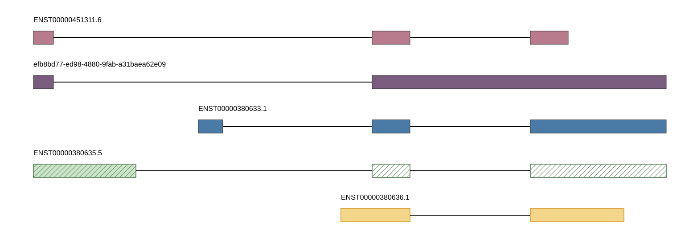
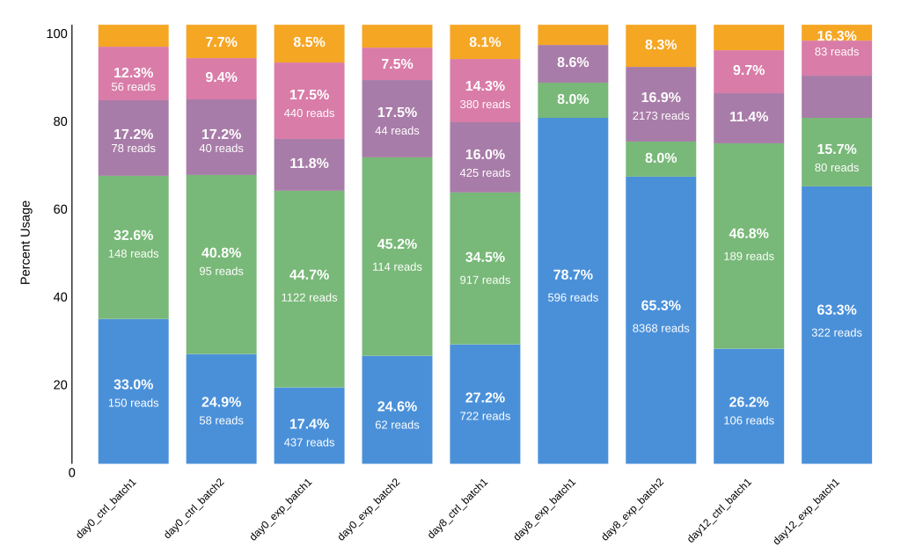

Additional programs
^^^^^^^^^^^^^^^^^^^

When you ``conda install`` or ``pip install`` flair, the following helper programs will be in your $PATH.
The options of each are generated from the program itself, so they are always what the program accepts.

annotate_aaseq_with_uniprot
===========================

.. include:: cli/annotate_aaseq_with_uniprot.rst

This is for aaseq predictions from FLAIR predictProductivity.

To obtain a UniProt reference file:
 - First go to: https://ftp.uniprot.org/pub/databases/uniprot/knowledgebase/reference_proteomes/
     - README file has mapping of your organism name to the proteome directory
 - Navigate to your organism’s directory
     - Human files are in: https://ftp.uniprot.org/pub/databases/uniprot/knowledgebase/reference_proteomes/Eukaryota/UP000005640/
 - Download the fasta and additional.fasta files
     - Human: download UP000005640_9606.fasta.gz (primary isoforms) and UP000005640_9606_additional.fasta.gz (alternative isoforms)
 - Cat together zipped files
     - Ex: cat UP000005640_9606.fasta.gz UP000005640_9606_additional.fasta.gz > UniProt_human_withadditional_100925.fasta.gz

**Output**

A fasta file similar to the input but with aaidXX changed to UniProt ID when possible

bed_to_gtf
==========

.. include:: cli/bed_to_gtf.rst

Convert isoforms in BED12 format to a GTF, written to standard output.

diff_iso_usage
==============

.. include:: cli/diff_iso_usage.rst

Calculates the usage of each isoform as a fraction of the total expression of the gene and compares this between samples.

Identifies and calculates significance of alternative isoform usage between two
samples using Fisher's exact tests. The more differentially used the isoforms are
between the first and second condition, the lower the p-value.

Output file format columns are as follows:

 - gene name
 - isoform name
 - p-value
 - sample1 isoform count
 - sample2 isoform count
 - sample1 alternative isoforms for gene count
 - sample2 alternative isoforms for gene count

diffsplice_fishers_exact
========================

.. include:: cli/diffsplice_fishers_exact.rst

Identifies and calculates the significance of alternative splicing
events between two samples without replicates using Fisher's exact
tests, from a flair diffsplice ``tsv`` of alternative splicing calls for
one splicing event type.

**Output**

The output file contains the original columns with an additional column
containing the p-values appended.

fasta_seq_lengths
=================

.. include:: cli/fasta_seq_lengths.rst

flair_partition
===============

.. include:: cli/flair_partition.rst

Defines non-overlapping regions across all of the input files, which is how FLAIR
splits work across threads.

gtf_to_bed
==========

.. include:: cli/gtf_to_bed.rst

Convert a GTF to a BED12 file.

identify_annotated_gene
=======================

.. include:: cli/identify_annotated_gene.rst

Names isoforms after the annotated gene whose splice junctions they match.

identify_gene_isoform
=====================

.. include:: cli/identify_gene_isoform.rst

Identifies the most likely gene id associated with each isoform and renames the
isoform.

junctions_from_sam
==================

.. include:: cli/junctions_from_sam.rst

mark_intron_retention
=====================

.. include:: cli/mark_intron_retention.rst

Assumes the bed has the correct strand information.

**Outputs**

 - an extended ``BED`` with an additional column containing either values 0 or 1 classifying the isoform as either spliced or intron-retaining, respectively
 - ``txt`` file of intron retentions with format ``isoform name`` ``chromosome`` ``intron 5' coordinate`` ``intron 3' coordinate``.

Note: A bed file with more additional
columns will not be displayed in the UCSC genome browser, but can be
displayed in IGV.

plot_isoform_usage
==================

.. include:: cli/plot_isoform_usage.rst

Visualization script for FLAIR isoform structures and the percent usage
of each isoform in each sample for a given gene. If you supply the
isoforms.bed file from running ``predictProductivity``, then isoforms
will be filled according to the predicted productivity (solid for
``PRO``, hatched for ``PTC``, faded for ``NGO`` or ``NST``). The gene
name supplied should correspond to a gene name in your isoform file and
counts file.

The script will produce two images, one of the isoform models and another of the usage proportions.

The most highly expressed isoforms across all the samples will be plotted.

The minor isoforms are aggregated into a gray bar. You can toggle min_reads or
color_palette to plot more isoforms.

**Outputs**

 - gene_name_isoforms.png of isoform structures
 - gene_name_usage.png of isoform usage by sample

For example:

